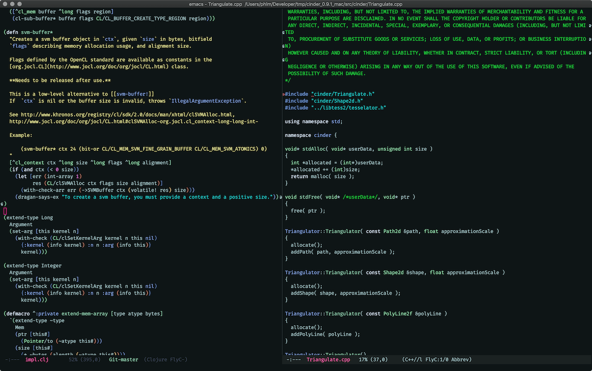

# Quartz theme
My two main sources of inspiration were [Alabaster Dark](https://github.com/tonsky/sublime-scheme-alabaster) and Jonathan Blow's Emacs theme (I spend too much time watching his streams on Twitch...)

I was always tweaking and refining my Emacs theme, but this came out of nowhere. I gave infamous [Nord](https://github.com/arcticicestudio/nord-emacs) theme a shot, started tweaking some colors to my liking, one thing led to another, and I've created Quartz (hence the reference to Alabaster). What I always disliked with popular themes like Solarized, One or Zenburn is low contrast. I always felt I was puting too much effort in distinguishing colors. This theme has perfect contrast ratio between elements I need to distinguish easiest on first look, comments, numbers, strings and code. Background is dark enough but not too dark, and I dislike plain black backgrounds. I find that this theme fits my needs perfectly in not being distracting while providing enough useful distinction between important elements on the screen.

